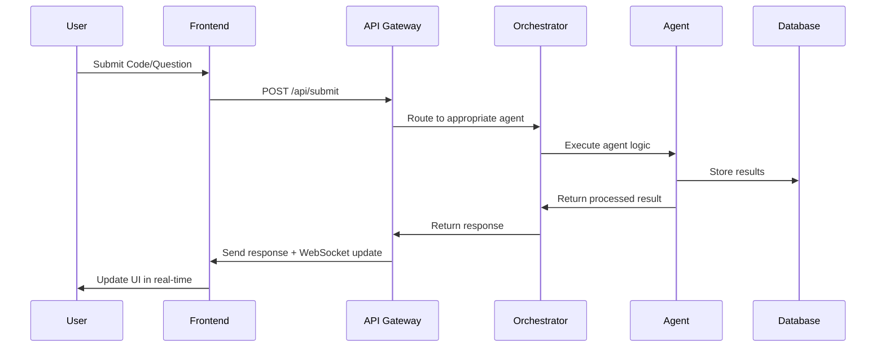
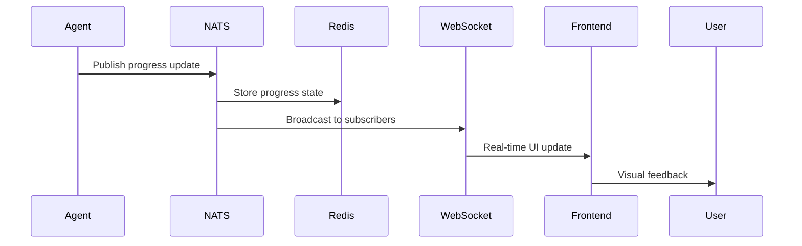

# System Architecture Documentation
**Jaseci Learning Companion - Enterprise Multi-Agent System**

**Author**: Cavin Otieno  
**Version**: 2.0.0-enterprise  
**Last Updated**: 2025-11-16

## 🏛️ Architecture Overview

The Jaseci Learning Companion employs a **microservices-based, cloud-native architecture** designed for enterprise-scale deployment with horizontal scaling, fault tolerance, and comprehensive observability.

### 🎯 Core Architectural Principles

1. **Microservices Architecture**: Each service is independently deployable, scalable, and maintainable
2. **Event-Driven Communication**: Asynchronous message passing via NATS for loose coupling
3. **Domain-Driven Design**: Clear separation of concerns across bounded contexts
4. **CAP Theorem Balance**: Optimized for consistency and availability with partition tolerance
5. **Security-First**: Zero-trust architecture with comprehensive security controls

## 🏗️ System Layers

### 1. 🌐 Frontend Layer (Client-Side)
**Technology Stack**: Next.js 14, TypeScript, Jac Client, Monaco Editor

```typescript
// Frontend Architecture Components
components/
├── dashboard/           # Main learning dashboard
├── code-editor/        # Interactive code editor with Monaco
├── progress-tracker/   # Real-time progress visualization
├── agent-visualizer/   # Multi-agent system visualization
├── assessment/         # Quality assessment interface
└── websocket-client/   # Real-time communication layer
```

**Key Features**:
- Real-time WebSocket communication
- Progressive Web App (PWA) capabilities
- Responsive design for all devices
- Monaco Editor with Jaseci syntax highlighting
- Live code execution and feedback

### 2. 🚪 API Gateway Layer (Edge)
**Technology Stack**: FastAPI, OAuth 2.0, JWT, Rate Limiting

```python
# API Gateway Architecture
api-gateway/
├── auth/              # Authentication & authorization
├── routing/           # Request routing & load balancing
├── middleware/        # Cross-cutting concerns
├── rate-limiting/     # API rate limiting
├── circuit-breaker/   # Fault tolerance
└── monitoring/        # Request monitoring & tracing
```

**Responsibilities**:
- Request routing and load balancing
- Authentication and authorization (OAuth 2.0 + JWT)
- API rate limiting and throttling
- Request/response transformation
- Circuit breaker pattern for fault tolerance
- Request monitoring and distributed tracing

### 3. 🔄 Message Bus Layer (Communication)
**Technology Stack**: NATS JetStream, Event Sourcing

```typescript
// Message Bus Topics
topics/
├── agent.requests.*           # Agent communication
├── progress.updates.*         # Learning progress events
├── assessment.results.*       # Quality assessment events
├── system.notifications.*     # System alerts
└── analytics.events.*         # Analytics data events
```

**Event Types**:
- **Command Events**: Direct agent instructions
- **Domain Events**: Learning progress, code submissions
- **Integration Events**: External system communications
- **System Events**: Health checks, alerts, monitoring

### 4. 🤖 Multi-Agent System Layer (Core Intelligence)
**Architecture Pattern**: Chain of Responsibility with Orchestration

```python
# Agent Registry & Orchestration
agents/
├── registry/           # Agent discovery and registration
├── orchestrator/       # Agent workflow coordination
├── learning-progress/  # Learning progress tracking agent
├── quiz-generator/     # AI-powered quiz generation (byLLM)
├── code-analyzer/      # Code Context Graph analysis
├── quality-assessor/   # Multi-dimensional quality evaluation
├── content-recommender/# Personalized content recommendations
└── analytics/          # Learning analytics and insights
```

**Agent Communication Patterns**:
- **Request-Response**: Direct agent communication
- **Publish-Subscribe**: Event-driven interactions
- **Command Query Separation**: CQRS pattern implementation

### 5. 📊 Data Layer (Persistence)
**Technology Stack**: PostgreSQL, Redis, Neo4j, Elasticsearch

```sql
-- Database Architecture
databases/
├── postgresql/        # Transactional data (users, progress, assessments)
├── redis/             # Caching and session management
├── neo4j/             # OSP Graph data (Code Context Graph)
└── elasticsearch/     # Search and analytics data
```

**Data Models**:
```python
# Core Entities
class User(BaseModel):
    id: UUID
    profile: UserProfile
    preferences: LearningPreferences
    progress: LearningProgress

class CodeSubmission(BaseModel):
    id: UUID
    user_id: UUID
    code: str
    ast: ASTNode
    ccg_representation: CCGNode
    quality_scores: QualityAssessment

class LearningSession(BaseModel):
    id: UUID
    user_id: UUID
    agent_interactions: List[AgentInteraction]
    progress_updates: List[ProgressUpdate]
    assessment_results: List[AssessmentResult]
```

### 6. 🔍 Observability Layer (Monitoring)
**Technology Stack**: Prometheus, Grafana, Jaeger, ELK Stack

```yaml
# Observability Stack
monitoring/
├── prometheus/        # Metrics collection
├── grafana/           # Dashboards and alerting
├── jaeger/            # Distributed tracing
├── elk-stack/         # Centralized logging
└── health-checks/     # Service health monitoring
```

## 🔄 Data Flow Architecture

### 1. Learning Flow


### 2. Real-time Progress Tracking


## 🔐 Security Architecture

### Authentication & Authorization
```python
# Security Flow
class SecurityLayer:
    def authenticate(self, token: str) -> User:
        """JWT token validation"""
        
    def authorize(self, user: User, resource: str) -> bool:
        """Role-based access control"""
        
    def audit_log(self, action: str, user: User):
        """Comprehensive audit logging"""
```

### Security Controls
- **Transport Security**: TLS 1.3 for all communications
- **Authentication**: OAuth 2.0 with JWT tokens
- **Authorization**: Role-Based Access Control (RBAC)
- **API Security**: Rate limiting, input validation, SQL injection prevention
- **Data Security**: Encryption at rest and in transit
- **Audit Logging**: Comprehensive audit trail for compliance

## 📈 Scalability & Performance

### Horizontal Scaling Strategy
```yaml
# Kubernetes HPA Configuration
apiVersion: autoscaling/v2
kind: HorizontalPodAutoscaler
metadata:
  name: agent-scaler
spec:
  scaleTargetRef:
    apiVersion: apps/v1
    kind: Deployment
    name: agents
  minReplicas: 3
  maxReplicas: 100
  metrics:
  - type: Resource
    resource:
      name: cpu
      target:
        type: Utilization
        averageUtilization: 70
```

### Performance Optimizations
- **Caching Strategy**: Multi-level caching (Redis, Application-level, CDN)
- **Database Optimization**: Read replicas, connection pooling, query optimization
- **Load Balancing**: Round-robin with health checks
- **Circuit Breakers**: Prevent cascade failures
- **Resource Pooling**: Efficient agent resource utilization

## 🌍 Deployment Architecture

### Cloud-Native Deployment
```yaml
# Kubernetes Deployment
apiVersion: apps/v1
kind: Deployment
metadata:
  name: jaseci-learning-platform
spec:
  replicas: 3
  selector:
    matchLabels:
      app: jaseci-learning-platform
  template:
    metadata:
      labels:
        app: jaseci-learning-platform
    spec:
      containers:
      - name: api-gateway
        image: jaseci-learning-companion/api-gateway:latest
        ports:
        - containerPort: 8000
        env:
        - name: DATABASE_URL
          valueFrom:
            secretKeyRef:
              name: database-secret
              key: url
```

### Deployment Environments
- **Development**: Docker Compose with hot reload
- **Staging**: Kubernetes with reduced resources
- **Production**: Multi-region Kubernetes with auto-scaling
- **Disaster Recovery**: Cross-region replication and backup

## 🔧 Configuration Management

### Environment Configuration
```python
# Configuration Hierarchy
class Settings(BaseSettings):
    # Application Settings
    APP_NAME: str = "Jaseci Learning Companion"
    APP_VERSION: str = "2.0.0-enterprise"
    DEBUG: bool = False
    
    # Database Configuration
    DATABASE_URL: str
    REDIS_URL: str
    NEO4J_URL: str
    ELASTICSEARCH_URL: str
    
    # Security Configuration
    SECRET_KEY: str
    JWT_ALGORITHM: str = "HS256"
    JWT_EXPIRE_MINUTES: int = 30
    
    # External Services
    OPENAI_API_KEY: Optional[str] = None
    HUGGINGFACE_API_KEY: Optional[str] = None
```

## 📊 Monitoring & Alerting

### Key Performance Indicators (KPIs)
- **System Health**: Service uptime, response time, error rates
- **User Experience**: Learning progress, engagement metrics, satisfaction scores
- **Agent Performance**: Processing time, accuracy, throughput
- **Business Metrics**: User retention, feature adoption, learning outcomes

### Alerting Strategy
```yaml
# Prometheus Alert Rules
groups:
- name: jaseci-learning-alerts
  rules:
  - alert: HighResponseTime
    expr: histogram_quantile(0.95, rate(http_request_duration_seconds_bucket[5m])) > 1
    for: 2m
    labels:
      severity: warning
    annotations:
      summary: "High response time detected"
      
  - alert: AgentFailure
    expr: rate(agent_requests_failed_total[5m]) > 0.1
    for: 1m
    labels:
      severity: critical
    annotations:
      summary: "Agent failure rate exceeded threshold"
```

## 🚀 Future Enhancements

### Planned Architecture Improvements
1. **Service Mesh**: Implement Istio for advanced traffic management
2. **Event Sourcing**: Full event sourcing for audit and replay capabilities
3. **CQRS Pattern**: Enhanced read/write separation for better performance
4. **GraphQL API**: Alternative API layer for complex frontend queries
5. **AI/ML Pipeline**: Real-time model training and deployment
6. **Multi-Region**: Global deployment with data localization

### Technology Evolution Roadmap
- **Q1 2025**: Service mesh implementation
- **Q2 2025**: Event sourcing and CQRS
- **Q3 2025**: GraphQL API and advanced caching
- **Q4 2025**: Multi-region deployment and AI pipeline

---

**Next Steps**: [Agent Registry Implementation](../agents/registry/README.md)